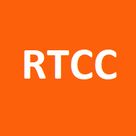

# RTCChat

### Description

RTCChat is a WhatsApp inspired small scale messaging service. After creating an account, the user is ready for adding contacts to their friend list, and starting conversations with them. The messaging view follows closely the familiar design standards of similar applications, allowing users to share instant messages, links and image attachments.

The application works most reliably in Chromium-based browsers. It can be used regularly with a web browser, and for enhancing the user experience, it's installable on devices using browsers with PWA support. It's also recommendable to enable push notifications to utilize functions that notify the user of new messages even if the application is shut down.

The UI is responsive, i.e. it adapts to different screen sizes, extending from large desktop monitors to mobile devices.

### Technologies

This is my second full stack development exercise. Both server and front-end are mainly written with TypeScript. The Node server provides a GraphQL API built with Apollo Server, and it's connected to a PostgreSQL database. The server uses an Express http-server, which is wrapped together with WebSocket connection used for two-way communication with the client to enable instant data transfer needed for messaging functionality. Database connections are handled with Sequelize ORM using its methods along with raw SQL queries.

The React-based front-end is built using webpack module bundler. It connects to the server with an Apollo Client instance utilizing its hooks for queries, mutations and subscriptions. The navigations is handled with HashRouter provided by react-router-dom. The main element, ContextWrapper, works as the base component in the hierarchy providing all necessary contexts, and forwarding nested components including their own subcomponents as its children.

The manually constructed service worker is used for handling push notifications: if the application is shut down, or an active message view client with the sender of a new message isn't found, the user is alerted of a new message. Clicking the notification dialog navigates to the relevant conversation, focuses on already open client, or opens a new client directly to conversation view with the sender if necessary. A permission for receiving push notifications is requested after a user has created an account and logs in. The choice is then saved in user settings to database and local storage.

User authentication is implemented by using the JSON Web Token standard: a modified user object with some additional information is encrypted into a token, which is then sent back to the user, and saved in local storage. The encryption of user data saved to database is done by using Bcrypt library.

The user interface is controlled solely with a regular CSS-file without any UI frameworks. The themes and colors may vary according to time of the year.

The application is running in fly.io. When deployed, a Docker image with production dependencies is created and a production build of the front-end is copied to 'front-build' folder located in the root of the server directory to be served as static content.

